<!-- generated by scripts/readme/build.mjs. do not edit by hand. -->

<a href="https://harnessfirmware.com"><picture>
<source media="(max-width: 500px) and (prefers-color-scheme: dark)" srcset="assets/readme/hero-narrow-dark.svg">
<source media="(max-width: 500px)" srcset="assets/readme/hero-narrow-light.svg">
<source media="(prefers-color-scheme: dark)" srcset="assets/readme/hero-dark.svg">

</picture></a>

This repository is the source of [harnessfirmware.com](https://harnessfirmware.com), the website for [Harness Firmware](https://github.com/ryanportfolio/Harness-Firmware). Harness Firmware is a repository starter for Claude Code and Codex: project memory committed to the repo, skills that load when a task calls them, review by a second model or a second vendor, and long-running work split into audited rounds. The firmware has its own repository; this one holds the site that explains it.

## Run it locally

The site is plain HTML, CSS and ES modules. There is nothing to install and no build step; the preview server needs Node.js.

```sh
node site/server.mjs
```

Then open http://127.0.0.1:4348. Set `PORT` to use another port. The server serves only `site/`, answers the same clean routes Vercel does, and mounts the API behind `/new`.

## Pages

<!-- pages:start -->
| Route | Source | What it shows |
| --- | --- | --- |
| [`/`](https://harnessfirmware.com/) | [`site/index.html`](site/index.html) | The six pillars, then the loop a task runs through from your goal to human approval |
| [`/skills`](https://harnessfirmware.com/skills) | [`site/skills.html`](site/skills.html) | The skill library: what each skill does and when it loads |
| [`/memory`](https://harnessfirmware.com/memory) | [`site/memory.html`](site/memory.html) | How project memory finds the context a task needs, and the lessons that carry into the next session |
| [`/new`](https://harnessfirmware.com/new) | [`site/new.html`](site/new.html) | Create a GitHub repository with the firmware installed and only the skills you pick |
| [`/arena`](https://harnessfirmware.com/arena) | [`site/arena.html`](site/arena.html) | Arena: try several solutions before one shape becomes the whole project |
| [`/long-horizon`](https://harnessfirmware.com/long-horizon) | [`site/long-horizon.html`](site/long-horizon.html) | Long Horizon: keep the goal intact when the work outgrows a session |
<!-- pages:end -->

## Repository layout

| Path | What it holds |
| --- | --- |
| [`site/`](site) | The site: pages, styles, modules, fonts and images. [`site/README.md`](site/README.md) documents the fonts, the motion modules and the creator; [`site/PROVENANCE.md`](site/PROVENANCE.md) lists third-party assets and their licenses. |
| [`api/harness/github/[action].mjs`](api/harness/github) | The Vercel function behind `/new`, answering `status`, `connect`, `callback`, `select`, `disconnect` and `create`. It passes each request to `site/github-creator.mjs`, the handler the local server mounts. |
| [`vercel.json`](vercel.json), [`.vercelignore`](.vercelignore) | Deploy settings: `site/` as the output directory, clean URLs, security headers and caching. Only `site/`, `api/` and `vercel.json` are uploaded. |
| [`scripts/readme/`](scripts/readme) | Builds this README, its art and the repository's About panel. |
| `.claude/`, `.agents/`, `docs/`, `CLAUDE.md`, `AGENTS.md`, `GUIDE.md` | Harness Firmware itself, installed here: the rules, memory and skills the agents working on this site follow. [`GUIDE.md`](GUIDE.md) explains them. |

## The /new creator

Without credentials, `/new` links to the GitHub template page for Harness Firmware. With a GitHub App configured, a visitor authorizes once and picks the skills they want; the server creates the repository from `ryanportfolio/Harness-Firmware`, commits the skill settings and removes the skills they left out. Tokens stay in encrypted HttpOnly cookies scoped to `/api/harness/github`.

To run it locally, copy `site/.env.example` to `site/.env`, fill in the GitHub App values, and start the server with the file:

```sh
node --env-file=site/.env site/server.mjs
```

`--env-file` needs Node.js 20.6 or newer. The app's permissions and callback URL are in [`site/README.md`](site/README.md#project-creator-new).

## Deploy

Vercel runs no build here. It serves `site/` as static files and `api/` as Node functions, as `vercel.json` sets out, and every push to `main` goes live at harnessfirmware.com. The creator's GitHub App credentials are Vercel environment variables, named as in `site/.env.example`.

## Tests

```sh
node --test site/github-creator.test.mjs
node scripts/readme/verify.mjs
```

The first covers the creator's security checks: OAuth state signing, cookie encryption, same-origin writes, repository names and skill selection. The second rebuilds this README and its art and fails if the committed copies are stale. CI runs both on every pull request.

## The README art

`node scripts/readme/build.mjs` draws the headline at the top of this page. It reads the 6 pillar words, their lines and the skills behind each from `site/hero-pillars.mjs`, the module that animates the home page, and keeps that module's timing: a 1000 ms entrance, a 1900 ms rest, and letters that start 55 ms apart per em of width. GitHub shows README images without scripts or web fonts, so the letters are outlines cut from the site's own font files by `scripts/readme/glyphs.py`. Change a pillar on the site, run the build, and commit both.

## License

Code: [MIT](LICENSE). The four fonts in `site/assets/fonts/` are under the SIL Open Font License 1.1, and the outlines in the README art come from the same files; sources and versions are in [`site/PROVENANCE.md`](site/PROVENANCE.md).
